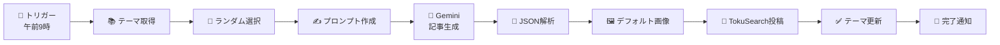

# 🎯 コラム自動生成（画像なし版）

**完全無料**でコラム記事を自動生成・投稿するn8nワークフロー

---

## ✨ 特徴

- ✅ **完全無料** - 月間コスト$0
- ✅ **自動実行** - 毎日決まった時刻に起動
- ✅ **高品質** - Gemini 2.5 Flashで2000-3000文字の記事生成
- ✅ **簡単設定** - 5分でセットアップ完了
- ✅ **拡張可能** - 後から画像生成を追加可能

---

## 📦 ファイル構成

```
column-workflow-no-image.json  → n8nワークフローファイル
SETUP_NO_IMAGE.md             → 詳細セットアップガイド
NO_IMAGE_README.md            → このファイル
```

---

## 🚀 クイックスタート

### 1. インポート（1分）

```
n8n → + → Import from File → column-workflow-no-image.json
```

### 2. 認証設定（3分）

**N8N API Key Auth**のみ新規作成が必要

```bash
# APIキー生成（PowerShell）
-join ((65..90) + (97..122) + (48..57) | Get-Random -Count 32 | ForEach-Object {[char]$_})

# 環境変数に追加
# .env.local
N8N_API_KEY=生成されたキー

# n8nで認証情報作成
Credentials → Header Auth
Name: N8N API Key Auth
Header Name: x-api-key
Header Value: 生成されたキー
```

### 3. テスト実行（1分）

```
「毎日9時トリガー」を右クリック → Execute Node
```

### 4. 有効化

```
ワークフロー右上のトグル → Active
```

**完了！** 🎉

---

## 📊 ワークフロー図



---

## 🎨 付箋で見やすく解説

ワークフロー内に**5つの付箋**があり、各セクションの役割を説明しています：

| 色 | セクション | 説明 |
|----|----------|------|
| 🔵 青 | トリガー | 毎日午前9時に自動実行 |
| 🟢 緑 | テーマ選択 | Google Sheetsから未使用テーマをランダム選択 |
| 🟡 黄 | 記事生成 | Gemini 2.5 Flashで高品質な記事を生成 |
| 🟠 オレンジ | 投稿処理 | デフォルト画像を使用してTokuSearchに投稿 |
| 🟣 紫 | 完了通知 | 投稿完了メッセージを作成 |

---

## 💰 コスト比較

| 項目 | 画像なし版 | 画像あり版 |
|------|----------|----------|
| 記事生成 | $0 | $0 |
| 画像生成 | $0（デフォルト） | $1〜2/月 |
| **合計** | **$0/月** | **$1〜2/月** |

---

## 🖼️ デフォルト画像について

### 現在の設定


```
URL: https://placehold.co/1200x675/f97316/ffffff?text=TokuSearch+Column
サイズ: 1200x675（16:9）
色: オレンジ (#f97316)
```

### カスタマイズ

「投稿データ準備」ノードで変更可能：

```javascript
// 色を変更（青に）
const thumbnailUrl = 'https://placehold.co/1200x675/3b82f6/ffffff?text=Column';

// 独自画像を使用
const thumbnailUrl = 'https://yourdomain.com/images/default.png';
```

---

## 🔧 カスタマイズ例

### 実行時刻を変更

```
0 9 * * *     → 毎日9時（デフォルト）
0 21 * * *    → 毎日21時
0 9 * * 1,3,5 → 月・水・金の9時
```

### 記事の文字数を変更

「記事生成プロンプト作成」ノードで：

```
【文字数】: 2000-3000文字 → 1500-2000文字
```

### Slack通知を追加

「完了通知メッセージ作成」ノードの後に：

```
Slackノードを追加
→ メッセージに $json.message を使用
```

---

## 📈 将来の拡張

このワークフローは後から機能追加できます：

### オプション1: AI画像生成

```
Nano Banana Pro API追加
→ $1〜2/月で自動画像生成
→ column-workflow-final.json を参照
```

### オプション2: 手動画像追加

```
記事投稿後に管理画面から追加
→ 追加コストなし
→ 完全なコントロール
```

### オプション3: 外部画像サービス

```
Unsplash、Pixabayなどから取得
→ 無料の高品質画像
→ 著作権に注意
```

---

## 🐛 よくある質問

### Q1: 本当に完全無料ですか？

**A**: はい。Gemini 2.5 Flashは1日25リクエストまで無料で、デフォルト画像も無料です。

### Q2: 画像は後から追加できますか？

**A**: はい。管理画面から手動追加、または後でNano Banana Pro APIを追加できます。

### Q3: 記事の品質は？

**A**: Gemini 2.5 Flashは高品質です。プロンプトを調整することでさらに改善できます。

### Q4: 実行頻度を変更できますか？

**A**: はい。Cronエディションで自由に設定できます（毎日、週3回など）。

### Q5: 商用利用できますか？

**A**: はい。TokuSearchの利用規約に従ってご利用ください。

---

## 📚 関連ドキュメント

- **詳細セットアップ**: [SETUP_NO_IMAGE.md](./SETUP_NO_IMAGE.md)
- **画像あり版**: [SETUP_FINAL.md](./SETUP_FINAL.md)
- **元のドキュメント**: [docs/COLUMN_AUTO_GENERATION.md](./docs/COLUMN_AUTO_GENERATION.md)

---

## 🤝 サポート

問題や質問がある場合：

1. [SETUP_NO_IMAGE.md](./SETUP_NO_IMAGE.md)のトラブルシューティングを確認
2. n8nのログを確認
3. GitHubでIssueを作成

---

## 📝 更新履歴

| バージョン | 日付 | 変更内容 |
|-----------|------|---------|
| 4.0 | 2025-11-27 | 画像なし版として完成 |

---

## 🎉 まとめ

- **5分でセットアップ** 📦
- **完全無料** 💰
- **毎日自動実行** ⏰
- **高品質な記事** ✍️
- **後から拡張可能** 🚀

**今すぐ始めましょう！** 🎊

---

**作成者**: TokuSearch開発チーム  
**ライセンス**: MIT  
**バージョン**: 4.0


