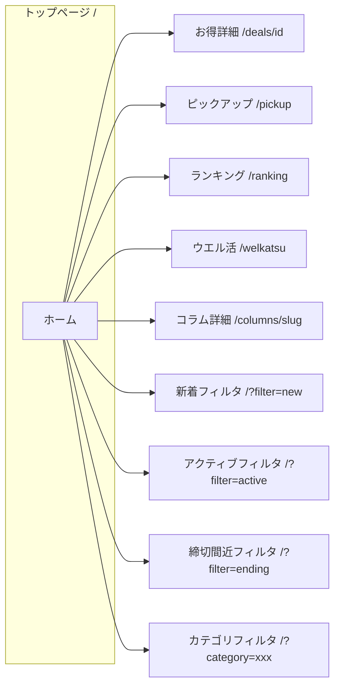
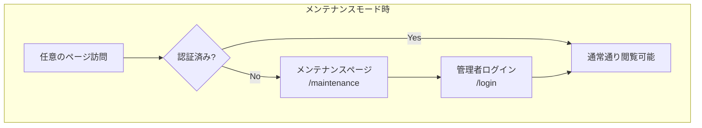
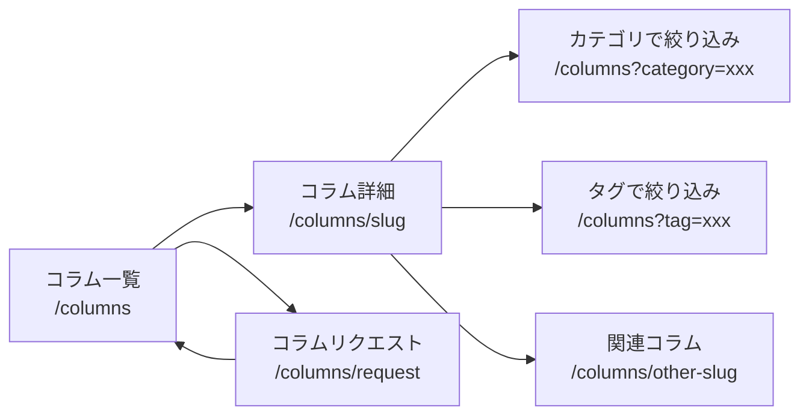
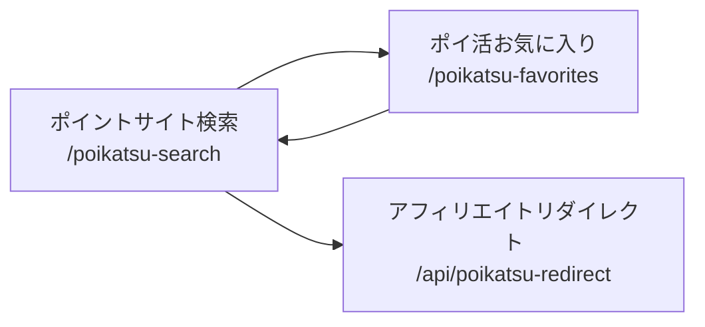

# TokuSearch 画面遷移図

## 概要

本ドキュメントは TokuSearch アプリケーションの画面遷移を図示したものです。

---

## 1. 全体構成図（一般ユーザー向け）

```mermaid
flowchart TB
    subgraph 入口
        A[トップページ<br/>/]
    end

    subgraph 特集一覧
        B[ピックアップ<br/>/pickup]
        C[ウエル活<br/>/welkatsu]
        D[ランキング<br/>/ranking]
        E[マガジン<br/>/magazine]
        F[新着<br/>/shinchaku]
    end

    subgraph お得情報
        G[お得詳細<br/>/deals/[id]]
    end

    subgraph コラム
        H[コラム一覧<br/>/columns]
        I[コラム詳細<br/>/columns/[slug]]
        J[コラムリクエスト<br/>/columns/request]
    end

    subgraph ポイ活
        K[ポイントサイト検索<br/>/poikatsu-search]
        L[ポイ活お気に入り<br/>/poikatsu-favorites]
    end

    subgraph その他
        M[お気に入り<br/>/favorites]
        N[アバウト<br/>/about]
        O[ポリシー<br/>/policy]
    end

    A --> B
    A --> C
    A --> D
    A --> E
    A --> F
    A --> G
    A --> H
    A --> K
    A --> M
    A --> N

    B --> G
    C --> G
    C --> C2[ウエル活アーカイブ<br/>/welkatsu/archive]
    D --> G
    D --> E
    E --> G
    F --> G

    H --> I
    H --> J
    I --> H
    I --> I2[関連コラム]
    J --> H

    K --> L
    L --> K

    G --> M
    G --> A

    N --> O
```

---

## 2. ヘッダーナビゲーションからの遷移

公開サイトの **Header** コンポーネントから遷移可能な画面：

| リンク | 遷移先 | 説明 |
|--------|--------|------|
| ホーム | `/` | トップページ（お得ダッシュボード） |
| ピックアップ | `/pickup` | 優先度Aの注目お得＋新着 |
| ウエル活 | `/welkatsu` | ウエル活向けお得一覧 |
| ランキング | `/ranking` | スコア・割引額・終了間近ランキング |
| ポイントサイト検索 | `/poikatsu-search` | ポイ活横断検索 |
| コラム | `/columns` | コラム一覧 |
| お気に入り | `/favorites` | お得のお気に入り一覧 |
| アバウト | `/about` | サービス説明 |

**フッター** からの遷移：`/about`、`/policy`

---

## 3. トップページからの遷移



---

## 4. 管理画面の遷移

```mermaid
flowchart TB
    subgraph 認証
        L[ログイン<br/>/login]
        A[ダッシュボード<br/>/admin/dashboard]
    end

    subgraph コラム管理
        B[コラム一覧<br/>/admin/columns]
        C[コラム新規作成<br/>/admin/columns/new]
        D[コラム編集<br/>/admin/columns/[id]/edit]
    end

    subgraph お得情報管理
        E[お得一覧<br/>/admin/deals]
        F[お得編集<br/>/admin/deals/[id]/edit]
    end

    ENTRY[/admin] --> L
    L --> A
    A --> B
    A --> E
    B --> C
    B --> D
    E --> F
    C --> B
    D --> B
    F --> E

    A --> SITE[サイトを表示 → /]
    L --> SITE2[トップへ /]
```

**管理画面の入口**：
- `/admin` にアクセス → `/login` にリダイレクト
- ログイン成功後 → `/admin/dashboard` へ

**管理画面サイドバー**：
- ダッシュボード → `/admin/dashboard`
- コラム管理 → `/admin/columns`
- お得情報管理 → `/admin/deals`
- サイトを表示 → `/`（新規タブ）
- ログアウト → `/login`

---

## 5. メンテナンスモード時の遷移



**条件**：環境変数 `MAINTENANCE_MODE=1` のとき  
**除外パス**：`/maintenance`、`/admin`、`/login` は常にアクセス可能  
**裏口**：ログイン済みの場合は全ページ閲覧可能

---

## 6. ページ一覧（パス一覧）

### 一般ユーザー向け

| パス | 画面名 | 備考 |
|------|--------|------|
| `/` | トップページ | 今日のお得ダッシュボード |
| `/pickup` | ピックアップ | 優先度A＋新着 |
| `/welkatsu` | ウエル活 | 当月1〜20日関連 |
| `/welkatsu/archive` | ウエル活アーカイブ | 過去分 |
| `/ranking` | ランキング | 3種ランキング |
| `/magazine` | マガジン | 編集部おすすめ・カテゴリ別特集 |
| `/shinchaku` | 新着 | 過去24時間の新着 |
| `/deals/[id]` | お得詳細 | 1件の詳細表示 |
| `/columns` | コラム一覧 | 新着順・ランキング・カテゴリ別 |
| `/columns/[slug]` | コラム詳細 | 本文・関連コラム |
| `/columns/request` | コラムリクエスト | テーマリクエスト送信 |
| `/poikatsu-search` | ポイントサイト検索 | 横断検索 |
| `/poikatsu-favorites` | ポイ活お気に入り | 検索で保存したお気に入り |
| `/favorites` | お気に入り | お得のローカルお気に入り |
| `/about` | アバウト | サービス説明 |
| `/policy` | ポリシー | 利用規約等 |
| `/login` | ログイン | 管理者用 |
| `/maintenance` | メンテナンス | メンテ時表示 |
| `/oauth2callback` | OAuth2コールバック | Google連携等 |
| `/not-found` | 404 | 存在しないページ |

### 管理画面（要認証）

| パス | 画面名 | 備考 |
|------|--------|------|
| `/admin` | （リダイレクト） | → `/login` |
| `/admin/dashboard` | ダッシュボード | 概要統計 |
| `/admin/columns` | コラム一覧 | 管理用 |
| `/admin/columns/new` | コラム新規作成 | |
| `/admin/columns/[id]/edit` | コラム編集 | |
| `/admin/deals` | お得一覧 | 管理用 |
| `/admin/deals/[id]/edit` | お得編集 | |

---

## 7. コラム関連の詳細遷移



---

## 8. ポイ活関連の遷移



---

*本ドキュメントは APP_OVERVIEW_AND_SPEC.md および実際のルーティング構成に基づいて作成されています。*
